# RunbookHermes

**Hermes-native AIOps Agent for payment incident response, evidence-driven root-cause analysis, approval-gated remediation, and runbook learning.**

RunbookHermes is built by adapting the official **Hermes Agent** runtime into a production-oriented incident-response system. It keeps Hermes Agent's strengths—runtime loop, provider routing, tool system, memory, context engine, skills, gateway, and safety boundaries—and specializes them for AIOps workflows such as payment-system failures, observability evidence collection, approval, checkpoint, rollback, recovery verification, and runbook knowledge accumulation.

> RunbookHermes is not a separate toy dashboard beside Hermes Agent. It is a Hermes-native vertical extension: Hermes provides the agent foundation; RunbookHermes adds the incident-response domain layer.

---

## Product Screenshots

The screenshots below show the current RunbookHermes Web Console. Put these images under `docs/assets/` and keep the file names consistent with the Markdown paths.

### AIOps Console Overview

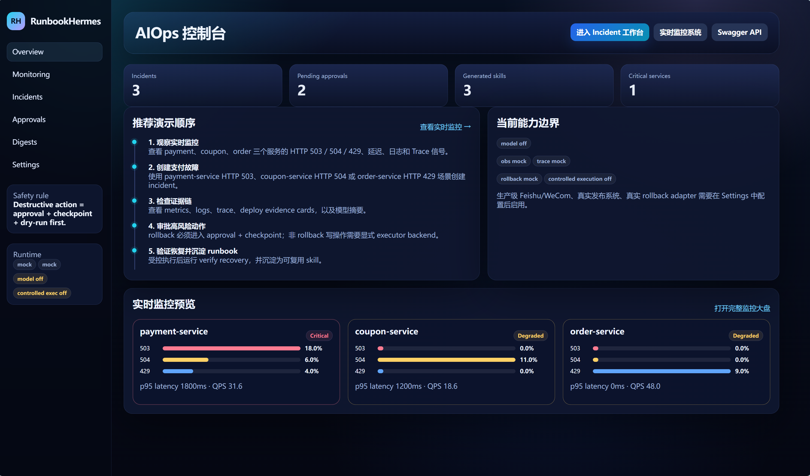

The overview page shows the high-level AIOps control plane: incident count, pending approvals, generated skills, critical services, recommended operation flow, current capability boundaries, and a live monitoring preview.

### Realtime Monitoring System

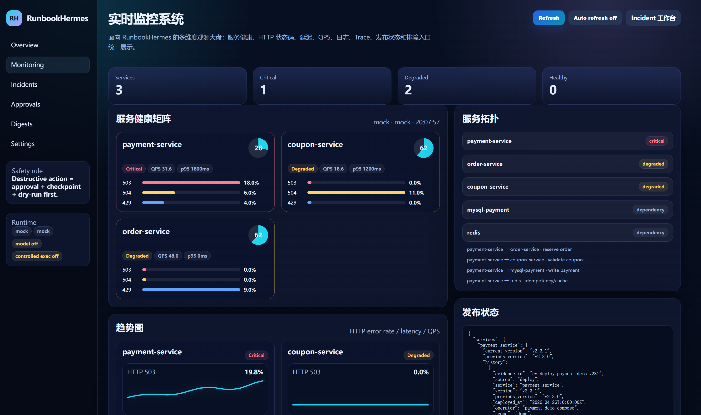

The monitoring page provides a multi-dimensional service health view for `payment-service`, `coupon-service`, and `order-service`, including HTTP status signals, QPS, p95 latency, service topology, backend mode, and deployment state.

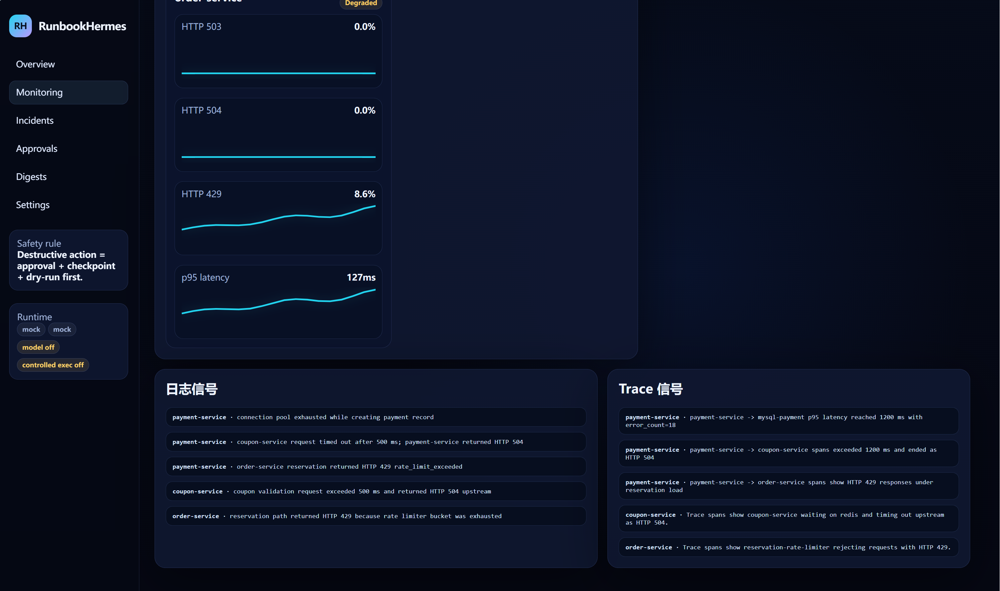

The lower section of the monitoring page shows log signals and trace signals. This is where RunbookHermes connects observability data to incident diagnosis instead of relying only on model guesses.

### Incident Command Center

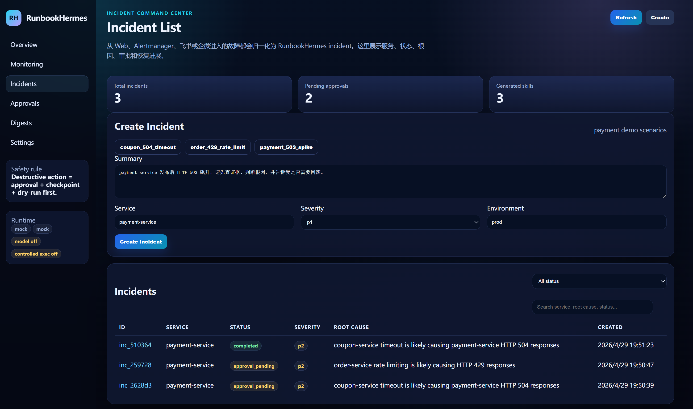

The incident list page normalizes incidents created from Web, Alertmanager, Feishu, WeCom, or API entry points. It shows service, status, severity, root cause, creation time, and quick incident creation actions.

### Incident Detail: Evidence and Executive Summary

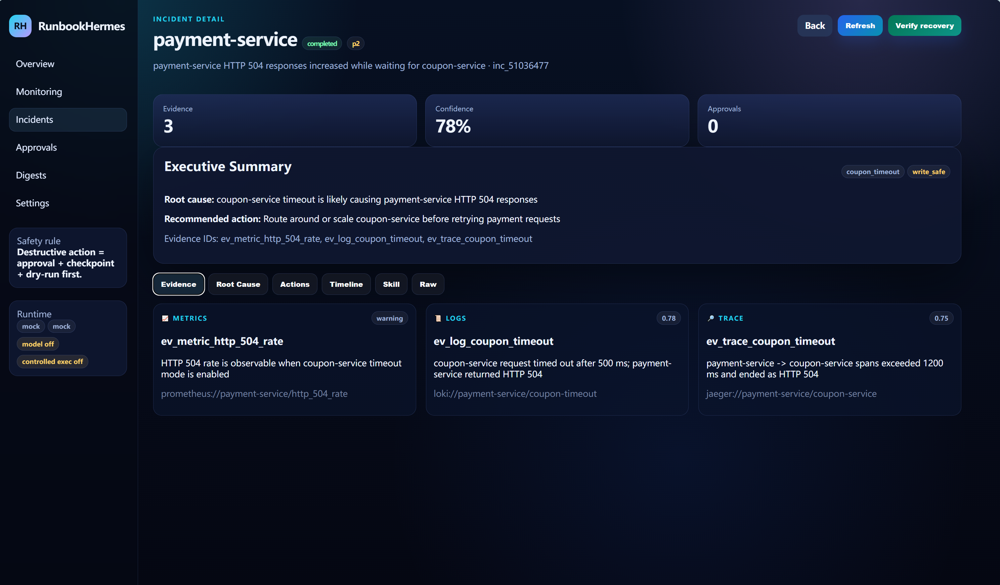

The incident detail page displays evidence cards from metrics, logs, and traces, plus an executive summary with root cause, recommended action, evidence IDs, confidence, and approval status.

### Incident Detail: Root Cause and Model-Assisted Summary

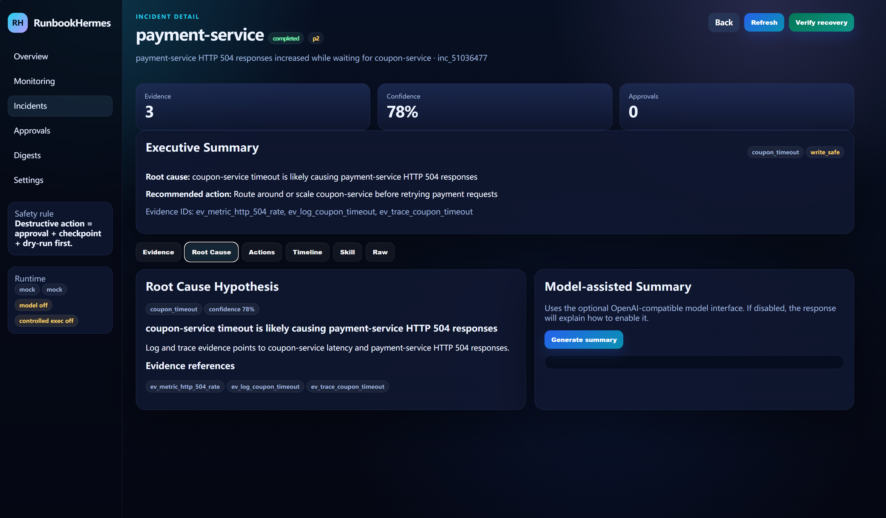

The root-cause tab separates deterministic evidence from optional model-assisted explanation. The model summary is only enabled when a model provider is configured.

### Incident Detail: Actions, Approvals, and Checkpoints

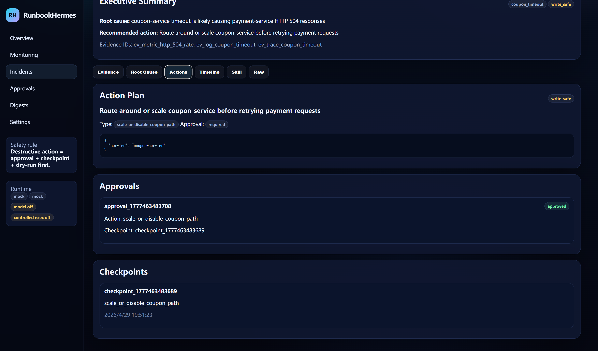

Risky actions are not executed blindly. RunbookHermes places write or destructive actions behind approval, checkpoint, dry-run, controlled execution, and recovery verification.

### Incident Detail: Timeline

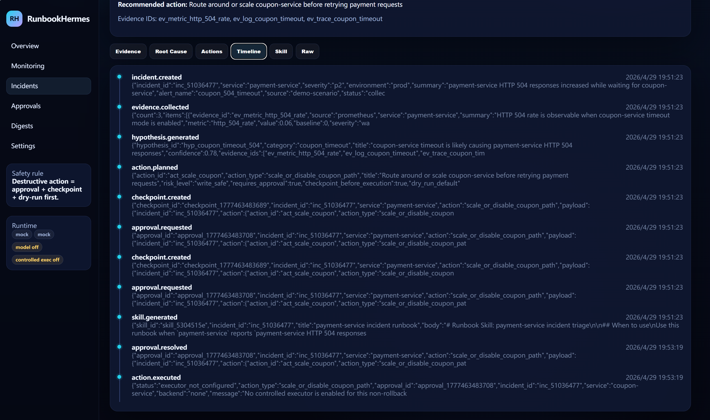

The timeline records the full incident lifecycle, including incident creation, evidence collection, hypothesis generation, action planning, checkpoint creation, approval request, approval decision, skill generation, and execution result.

### Incident Detail: Generated Runbook Skill

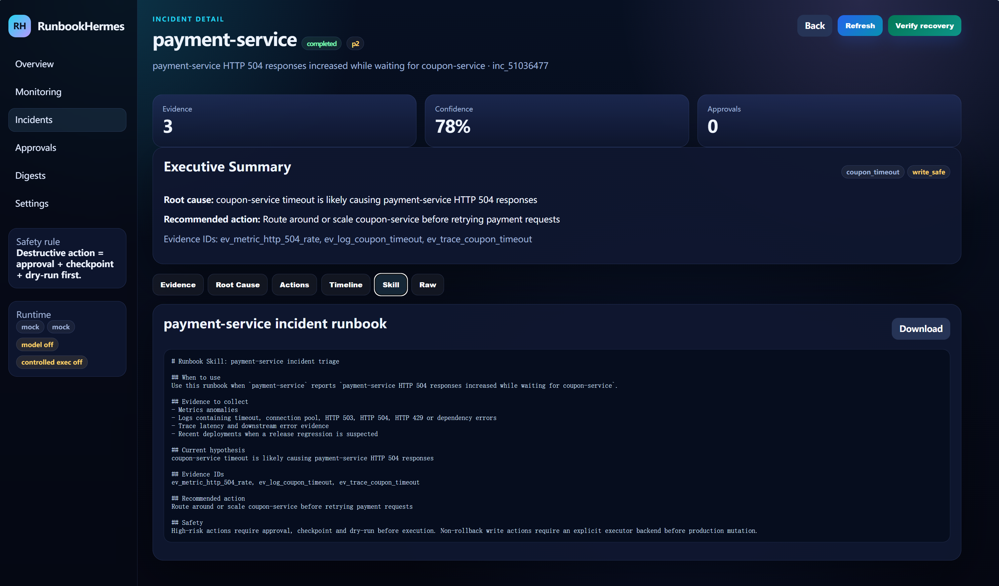

After an incident is processed, RunbookHermes can turn the operational experience into a reusable runbook skill. This is how incident handling becomes accumulated operational knowledge rather than a one-off response.

### Approval Center

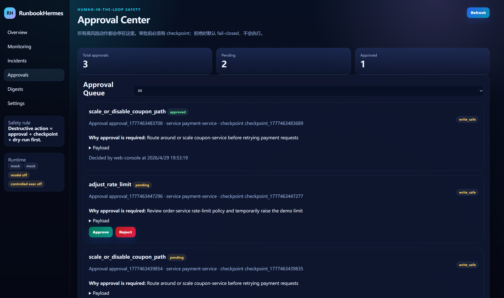

The approval center is the human-in-the-loop safety gate. Operators can review the action, risk level, checkpoint, and payload before approving or rejecting execution.

### Digests and Skills

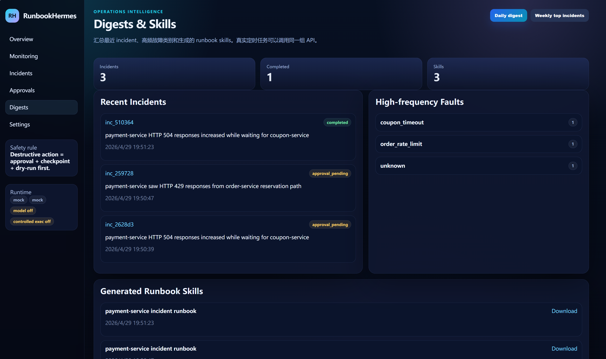

The digest page summarizes recent incidents, high-frequency faults, and generated runbook skills, making RunbookHermes useful for both incident response and operational review.

### Integration Readiness and Interface Status

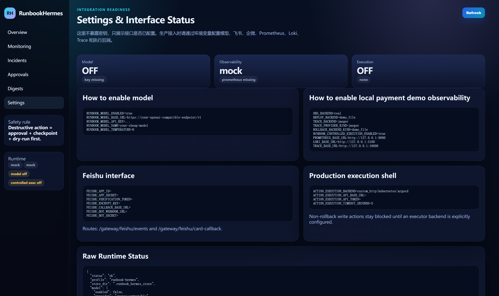

The settings page shows whether model, observability, execution, Feishu, WeCom, and other production integration interfaces are configured. It also documents the environment variables needed to connect real systems.

---

## Why RunbookHermes

Most AI Agent projects stop at chat, retrieval, or simple workflow automation. Real incident response requires much more:

* reliable evidence collection from monitoring, logs, traces, and deployments;
* context compression so models reason over evidence instead of raw log noise;
* memory that remembers useful operational experience without stuffing every history item into the prompt;
* tools that are governed by schemas, allowlists, and safety policies;
* approval and checkpoint before risky production actions;
* recovery verification after remediation;
* runbook skill generation so successful operations become reusable knowledge.

RunbookHermes was created to turn Hermes Agent into this kind of incident-response agent.

---

## What RunbookHermes Inherits from Hermes Agent

RunbookHermes is valuable because it is not built from scratch as a simple rule engine. It is based on Hermes Agent's architecture and adapts those capabilities into the AIOps domain.

| Hermes Agent capability   | RunbookHermes adaptation                                                                                                         |
| ------------------------- | -------------------------------------------------------------------------------------------------------------------------------- |
| Agent runtime / loop      | Used as the core agent foundation for the `runbook-hermes` profile.                                                              |
| Provider / model routing  | Keeps Hermes-style model provider flexibility and adds OpenAI-compatible model-summary integration for incident analysis.        |
| Tool system               | Adds incident-response tools for Prometheus, Loki, Jaeger/Trace, deploy history, approval, rollback, and recovery verification.  |
| Memory provider           | Adds `IncidentMemory` for service profiles, incident summaries, team preferences, and skill index.                               |
| Context engine            | Adds `EvidenceStack`, an evidence-centric context engine for alert, evidence, hypotheses, actions, and final answer compression. |
| Skills                    | Adds runbook skills such as payment HTTP 503 triage and common incident triage.                                                  |
| Gateway architecture      | Adds Alertmanager, Feishu, WeCom, and Web/API entry paths for incident workflows.                                                |
| Safety boundary           | Adds approval, checkpoint, dry-run, controlled execution, and recovery verification around risky actions.                        |
| Execution backend concept | Adds local reference rollback plus production executor interfaces such as `custom_http`, Kubernetes, and Argo CD style adapters. |

The goal is not to clone every Hermes feature into a dashboard. The goal is to preserve Hermes Agent's strengths and turn them into an operationally meaningful AIOps system.

---

## Core Capabilities

### 1. Incident Intake

RunbookHermes can receive incident signals through multiple entry points:

* Web Console
* Alertmanager webhook
* Feishu event and card callback shells
* WeCom event and card callback shells
* Hermes profile entry via `runbook-hermes`
* API endpoints for incident creation and replay

All entries are normalized into an incident command so different sources can flow into the same agent workflow.

### 2. Evidence Collection

RunbookHermes collects evidence from:

* Prometheus metrics
* Loki logs
* Jaeger / Trace backend
* deployment records
* service-specific profiles
* prior incident summaries
* runbook skills

The current code includes real adapter interfaces and a local reference payment environment for validating the integration path.

### 3. EvidenceStack Context Engine

Incident response produces too much raw context: logs, metric samples, traces, tool outputs, deployment records, approvals, and timelines. RunbookHermes does not dump all of that into the prompt.

Instead, `EvidenceStack` organizes context into:

* alert summary
* key evidence
* hypotheses
* action plan
* final answer

It keeps evidence IDs and summaries, while avoiding large raw logs and trace payloads in the long-running reasoning context.

### 4. IncidentMemory

RunbookHermes uses a domain-specific memory provider for incident response.

It remembers stable operational knowledge such as:

* service profiles;
* team preferences;
* incident summaries;
* recurring root causes;
* generated runbook skills;
* approval requirements for risky actions.

It does not treat memory as “save the whole chat history.” It is designed to recall the right operational facts at the right time.

### 5. Model-Assisted Analysis

RunbookHermes supports model-assisted incident summaries through OpenAI-compatible endpoints.

The model is used to improve analysis readability and operator-facing summaries, while the evidence chain and safety gates remain explicit.

Typical model-assisted outputs:

* incident summary;
* most likely root cause explanation;
* evidence chain explanation;
* operator-facing action summary;
* postmortem draft material.

### 6. Approval-Gated Remediation

RunbookHermes treats destructive actions as controlled operations.

High-risk actions such as rollback, restart, or configuration mutation should pass through:

1. action policy check;
2. approval request;
3. checkpoint creation;
4. dry-run;
5. controlled execution;
6. recovery verification;
7. audit timeline.

This is one of the main reasons RunbookHermes is built on a Hermes-style safety boundary instead of being a simple script runner.

### 7. Realtime Monitoring Dashboard

The Web Console includes a realtime monitoring view for:

* service health matrix;
* HTTP 503 / 504 / 429 signals;
* p95 latency;
* QPS;
* log signals;
* trace signals;
* deployment status;
* topology view;
* backend status for Prometheus, Loki, Trace, Deploy, model, Feishu, WeCom, and controlled execution.

---

## Repository Layout

```text
runbook-hermes/
├── agent/                              # Hermes Agent upstream runtime code
├── gateway/                            # Hermes upstream gateway foundation
├── hermes_cli/                         # Hermes CLI components
├── profiles/runbook-hermes/            # RunbookHermes Hermes profile and persona
├── plugins/runbook-hermes/             # RunbookHermes tool plugin
├── plugins/memory/incident_memory/     # IncidentMemory provider
├── plugins/context_engine/evidence_stack/ # EvidenceStack context engine
├── runbook_hermes/                     # RunbookHermes domain logic
├── apps/runbook_api/                   # FastAPI Web/API service
├── web/static/                         # Web Console pages
├── integrations/observability/         # Prometheus / Loki / Trace / Deploy adapters
├── toolservers/observability_mcp/      # Observability toolserver boundary
├── skills/runbooks/                    # Runbook skills
├── demo/payment_system/                # Local reference payment environment
├── data/payment_demo/                  # Reference deploy state and runtime version
├── data/runbook_mock/                  # Mock observability data for local fallback
├── scripts/                            # Validation and smoke scripts
└── docs/                               # Architecture, deployment, integration, operations docs
```

---

## Deployment Modes

RunbookHermes should be understood as one merged codebase:

```text
Hermes Agent upstream source
+ RunbookHermes AIOps extension layer
= RunbookHermes
```

You do **not** deploy “official Hermes Agent first” and then deploy RunbookHermes as a separate unrelated app. You deploy the merged RunbookHermes repository and run the entry points you need.

### Mode A: Web/API Only

Use this mode to inspect the Web Console, incident pages, approvals, monitoring UI, settings, and API surface.

```bash
set PYTHONPATH=.
python -m uvicorn apps.runbook_api.app.main:app --host 127.0.0.1 --port 8000
```

Open:

```text
http://127.0.0.1:8000/web/index.html
http://127.0.0.1:8000/web/monitoring.html
http://127.0.0.1:8000/web/incidents.html
http://127.0.0.1:8000/web/approvals.html
http://127.0.0.1:8000/docs
```

### Mode B: Local Reference Payment Environment

Use this mode to validate the full incident-response path with a local payment system and observability stack.

```bash
cd demo/payment_system
docker compose up --build
```

This starts a local reference environment containing:

* payment-service
* order-service
* coupon-service
* MySQL
* Redis
* Prometheus
* Loki
* Promtail
* Jaeger
* Grafana

Then configure RunbookHermes to use real local observability adapters:

```bash
set OBS_BACKEND=real
set DEPLOY_BACKEND=demo_file
set TRACE_BACKEND=jaeger
set TRACE_PROVIDER_KIND=jaeger
set ROLLBACK_BACKEND_KIND=demo_file
set RUNBOOK_CONTROLLED_EXECUTION_ENABLED=true

set PROMETHEUS_BASE_URL=http://127.0.0.1:9090
set LOKI_BASE_URL=http://127.0.0.1:3100
set TRACE_BASE_URL=http://127.0.0.1:16686

set DEMO_DEPLOY_STATE_FILE=data/payment_demo/deployments.json
set DEMO_VERSION_FILE=data/payment_demo/runtime/payment-service-version.txt
```

Start the Web/API service:

```bash
set PYTHONPATH=.
python -m uvicorn apps.runbook_api.app.main:app --host 127.0.0.1 --port 8000
```

Generate reference traffic:

```bash
cd demo/payment_system
python scripts/generate_traffic.py --fault PAYMENT_503_AFTER_DEPLOY --requests 60
python scripts/generate_traffic.py --fault COUPON_504_TIMEOUT --requests 40
python scripts/generate_traffic.py --fault ORDER_429_RATE_LIMIT --requests 40
```

These scenarios are not the final goal. They are a local reference environment for proving how RunbookHermes connects to real systems.

### Mode C: Production-Oriented Deployment

In a production-oriented deployment, RunbookHermes should run as a set of services:

```text
[Alertmanager]
     |
     v
[RunbookHermes API / Gateway]
     |
     +--> Hermes Agent Runner with runbook-hermes profile
     +--> Model Provider
     +--> Prometheus
     +--> Loki
     +--> Jaeger / Tempo
     +--> Deploy / Rollback System
     +--> Feishu / WeCom
     +--> Incident Store
     +--> Redis / Queue
     +--> Audit Log
```

Recommended production components:

* `runbookhermes-api`: FastAPI Web/API and webhook service;
* `runbookhermes-agent`: Hermes runner using `runbook-hermes` profile;
* `incident-store`: SQLite / MySQL / PostgreSQL, replacing local JSON store;
* `redis`: queue / cache / approval state support;
* `model-provider`: OpenAI-compatible or internal model endpoint;
* `observability`: Prometheus, Loki, Jaeger / Tempo;
* `messaging`: Feishu / WeCom callbacks;
* `executor`: controlled remediation adapter such as custom HTTP, Kubernetes, or Argo CD.

---

## Where Do I Chat with the Agent?

RunbookHermes has different interaction surfaces.

### 1. Hermes CLI / Agent Profile

For direct agent interaction:

```bash
hermes --profile runbook-hermes
```

Use this when you want the Hermes-native conversation loop.

Example prompt:

```text
payment-service HTTP 503 is rising after release. Please collect evidence first, then explain the most likely root cause and propose a safe action plan.
```

### 2. Web Console

The Web Console is not primarily a chat UI. It is the operator control plane:

* incident list;
* realtime monitoring;
* evidence cards;
* RCA results;
* action plans;
* approvals;
* checkpoints;
* recovery verification;
* generated skills;
* model-assisted summaries.

### 3. Feishu / WeCom

Feishu and WeCom adapters are intended for production messaging integration:

* create incident from message or alert;
* show RCA card;
* approve or reject risky action;
* link back to Web Console.

### 4. Alertmanager / API

Alertmanager and API entry points are designed for system-to-agent incident intake.

---

## Model Provider Setup

RunbookHermes can use an OpenAI-compatible endpoint for model-assisted summaries.

Example with OpenRouter or any compatible model provider:

```bash
set RUNBOOK_MODEL_ENABLED=true
set RUNBOOK_MODEL_BASE_URL=https://openrouter.ai/api/v1
set RUNBOOK_MODEL_API_KEY=your_api_key
set RUNBOOK_MODEL_NAME=your_model_name
```

Model output is used for readable incident summaries and operator-facing explanations. Evidence collection, approval boundaries, and remediation policies remain explicit and inspectable.

---

## Observability Integration

Configure real observability backends:

```bash
set OBS_BACKEND=real
set PROMETHEUS_BASE_URL=http://prometheus.example.com
set LOKI_BASE_URL=http://loki.example.com
set TRACE_BACKEND=jaeger
set TRACE_PROVIDER_KIND=jaeger
set TRACE_BASE_URL=http://jaeger.example.com
```

RunbookHermes uses these adapters:

* `integrations/observability/prometheus_backend.py`
* `integrations/observability/loki_backend.py`
* `integrations/observability/trace_backend.py`
* `integrations/observability/deploy_backend.py`

---

## Feishu / WeCom Integration

RunbookHermes includes gateway shells for Feishu and WeCom.

Feishu environment variables:

```bash
set FEISHU_APP_ID=
set FEISHU_APP_SECRET=
set FEISHU_VERIFICATION_TOKEN=
set FEISHU_ENCRYPT_KEY=
set FEISHU_CALLBACK_BASE_URL=
set FEISHU_BOT_WEBHOOK_URL=
set FEISHU_BOT_SECRET=
```

WeCom environment variables:

```bash
set WECOM_CORP_ID=
set WECOM_AGENT_ID=
set WECOM_SECRET=
set WECOM_TOKEN=
set WECOM_ENCODING_AES_KEY=
set WECOM_CALLBACK_BASE_URL=
```

Production use requires public callback routing, signature verification, encryption handling, permission setup, and card callback validation.

---

## Controlled Remediation

RunbookHermes is designed around safe production execution, not blind automation.

Supported remediation boundary:

```text
action policy
→ approval
→ checkpoint
→ dry-run
→ controlled execution
→ recovery verification
→ audit timeline
```

Local reference execution is available through the payment reference environment. Production execution should be connected through a controlled executor:

```bash
set ACTION_EXECUTION_BACKEND=custom_http
set ACTION_EXECUTION_API_BASE_URL=https://executor.example.com
set ACTION_EXECUTION_API_TOKEN=your_token
set ACTION_EXECUTION_TIMEOUT_SECONDS=5
```

Other possible executor types:

* Kubernetes controlled API
* Argo CD
* Argo Rollouts
* internal release platform
* custom HTTP remediation gateway

---

## Validation

Run validation scripts from the repository root:

```bash
set PYTHONPATH=.
python -S scripts/runbook_validate.py
python -S scripts/runbook_gateway_smoke.py
python -S scripts/runbook_no_legacy_imports.py
python -S scripts/runbook_monitoring_validate.py
python -S scripts/runbook_stage8_validate.py
```

---

## Current Status

RunbookHermes currently provides:

* Hermes-native RunbookHermes profile;
* incident-response tool plugin;
* IncidentMemory provider;
* EvidenceStack context engine;
* Web Console and monitoring dashboard;
* local reference payment environment;
* Prometheus / Loki / Jaeger adapter layer;
* Feishu / WeCom gateway shells;
* model-assisted summary shell;
* approval + checkpoint + controlled local rollback;
* production-oriented executor interfaces.

Recommended next hardening steps:

* replace local JSON store with SQLite / MySQL / PostgreSQL;
* add Memory Browser page;
* add Skill Forge page;
* complete Feishu / WeCom production callback verification;
* connect a real model provider;
* connect a real production deploy / rollback executor;
* add Kubernetes / Docker Compose production deployment manifests;
* add RBAC and audit persistence.

---

## Roadmap

See [ROADMAP.md](ROADMAP.md).

High-level roadmap:

* v0.1: Hermes-native incident-response foundation
* v0.2: stronger memory, skill, and monitoring UI
* v0.3: production observability integrations
* v0.4: Feishu / WeCom production messaging workflow
* v0.5: controlled Kubernetes / Argo remediation reference
* v1.0: production reference architecture

---

## Acknowledgements

RunbookHermes is built on top of **Hermes Agent** by Nous Research.

This project preserves the Hermes Agent foundation and adds an AIOps / incident-response layer for payment-system troubleshooting, observability integration, approval-gated remediation, and runbook learning.

The upstream Hermes README and release notes are kept under `docs/upstream/` for attribution and reference.

---

## License

This repository preserves the upstream Hermes Agent license. See [LICENSE](LICENSE).

RunbookHermes additions follow the same repository license unless otherwise stated.
