# RunbookHermes

**基于 Hermes Agent 改造的 AIOps / SRE 事故响应 Agent：证据驱动 RCA、审批保护执行、自进化 Runbook 记忆、RAG 知识库、评测与训练数据闭环。**

RunbookHermes 不是一个普通聊天机器人，也不是一个简单的监控看板。它的目标是把 Hermes Agent 的 Agent Runtime、工具系统、Memory、Skills、Gateway、多模型 Provider、上下文压缩和训练轨迹能力，改造成一个面向真实生产事故的 AIOps Agent。

它的工作方式是：

```text
告警进入
→ 先查证据
→ 再判断根因
→ 再给行动方案
→ 危险动作必须审批、checkpoint、dry-run
→ 执行后必须验证恢复
→ 最后沉淀 memory、RAG、runbook skill、eval case、training trajectory
```

RunbookHermes 最重要的价值不是“回答一次问题”，而是让系统在每次事故后变得更懂业务：

```text
越用越懂系统
越用越懂故障模式
越用越懂服务治理规则
越用越懂团队排障习惯
```

---

## 1. RunbookHermes 是什么

RunbookHermes 是一个 Hermes-native 的事故响应系统。

它保留 Hermes Agent 的底层能力，并在其上增加 AIOps / SRE 领域层：

```text
Hermes Agent Runtime
+ RunbookHermes AIOps Domain Layer
= RunbookHermes
```

Hermes Agent 提供通用 Agent 能力：

- Agent 主循环；
- Tool Registry；
- 多模型 Provider；
- CLI / Gateway 入口；
- MemoryProvider；
- Skills；
- 上下文压缩；
- 会话状态；
- RL 轨迹采集。

RunbookHermes 在这些能力上增加：

- 事故接入；
- Prometheus / Loki / Trace / Deploy evidence；
- EvidenceStack 上下文；
- RCA guard；
- Action policy；
- 审批、checkpoint、dry-run；
- controlled execution；
- recovery verification；
- 自进化 memory；
- citation RAG；
- multimodal evidence；
- eval benchmark；
- training / RL dataset pipeline；
- Web Console；
- Feishu / WeCom / Alertmanager 入口。

---

## 2. 核心原则

RunbookHermes 的设计原则非常明确。

### Evidence first

事故处理中不能先猜根因。

RunbookHermes 必须先收集：

- metrics；
- logs；
- traces；
- deploy history；
- service profile；
- memory context；
- RAG citation；
- multimodal evidence。

然后再生成 RCA。

### Memory is weak prior

记忆只能作为背景信息，不能替代当前证据。

```text
历史记忆可以提醒 Agent：
“这个服务以前也出现过类似故障”

但最终结论必须来自当前事故的 metrics、logs、traces、deploy evidence。
```

### Dangerous action must be gated

危险动作不能由模型直接执行。

包括但不限于：

- rollback；
- restart；
- scaling mutation；
- traffic switching；
- config mutation；
- database-affecting operation；
- cache flush；
- dependency failover。

RunbookHermes 的安全链路是：

```text
action policy
→ approval
→ checkpoint
→ dry-run
→ controlled execution
→ recovery verification
→ audit timeline
```

### Every incident improves the next incident

一次事故结束后，RunbookHermes 会沉淀：

- incident summary；
- fault pattern；
- service governance rule；
- team runbook habit；
- generated SKILL.md；
- RAG document；
- eval case；
- training trajectory；
- reward label。

这就是 RunbookHermes 越用越懂系统的原因。

---

---

## Product Screenshots

The screenshots below show the current RunbookHermes Web Console. Put these images under `docs/assets/` and keep the file names consistent with the Markdown paths.

### AIOps Console Overview

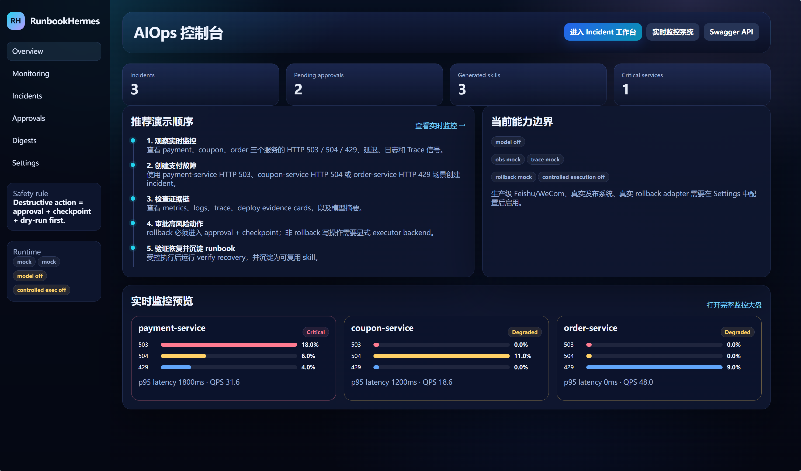

The overview page shows the high-level AIOps control plane: incident count, pending approvals, generated skills, critical services, recommended operation flow, current capability boundaries, and a live monitoring preview.

### Realtime Monitoring System

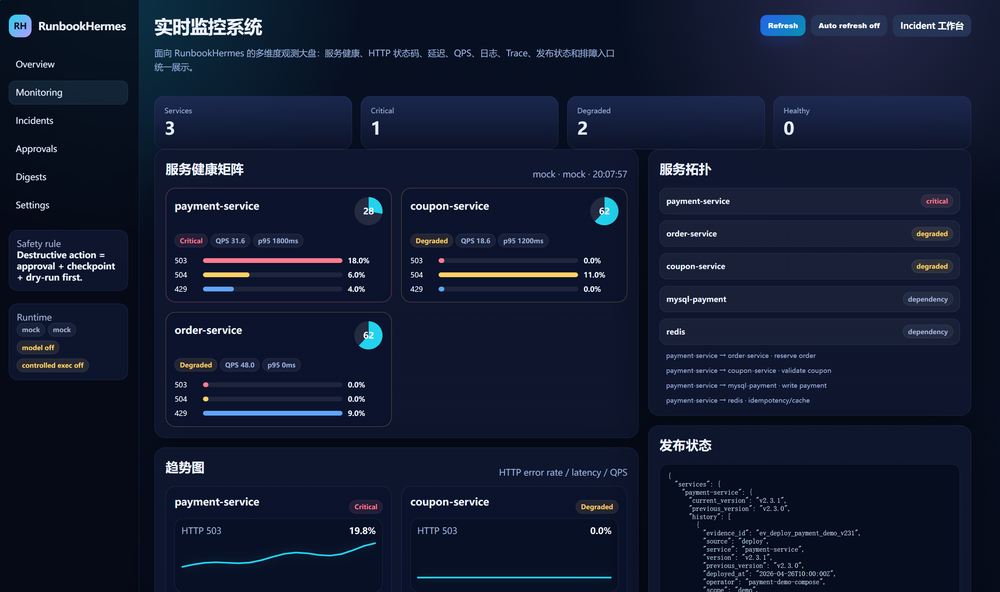

The monitoring page provides a multi-dimensional service health view for `payment-service`, `coupon-service`, and `order-service`, including HTTP status signals, QPS, p95 latency, service topology, backend mode, and deployment state.

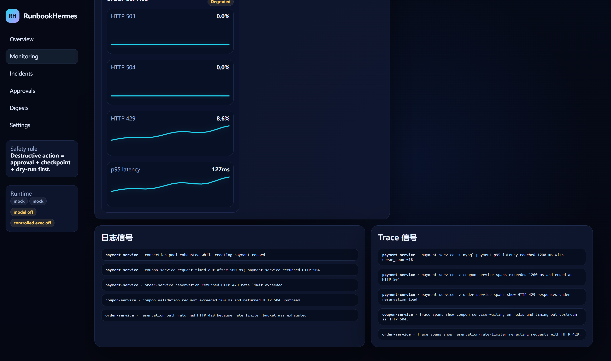

The lower section of the monitoring page shows log signals and trace signals. This is where RunbookHermes connects observability data to incident diagnosis instead of relying only on model guesses.

### Incident Command Center

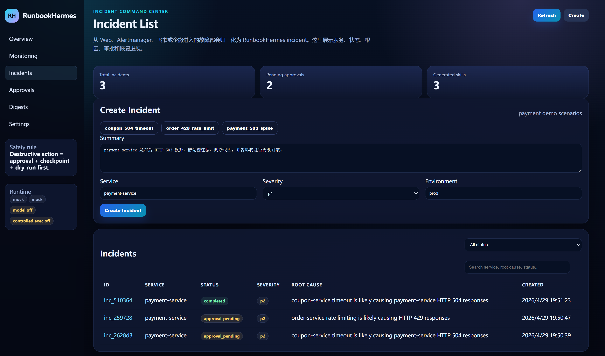

The incident list page normalizes incidents created from Web, Alertmanager, Feishu, WeCom, or API entry points. It shows service, status, severity, root cause, creation time, and quick incident creation actions.

### Incident Detail: Evidence and Executive Summary

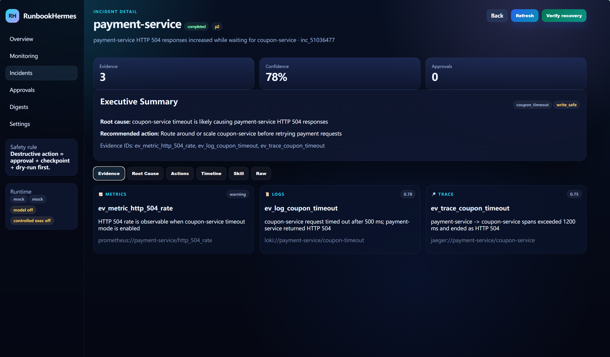

The incident detail page displays evidence cards from metrics, logs, and traces, plus an executive summary with root cause, recommended action, evidence IDs, confidence, and approval status.

### Incident Detail: Root Cause and Model-Assisted Summary

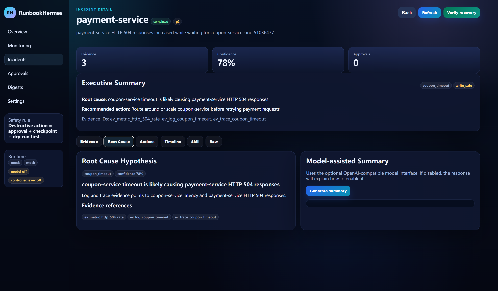

The root-cause tab separates deterministic evidence from optional model-assisted explanation. The model summary is only enabled when a model provider is configured.

### Incident Detail: Actions, Approvals, and Checkpoints

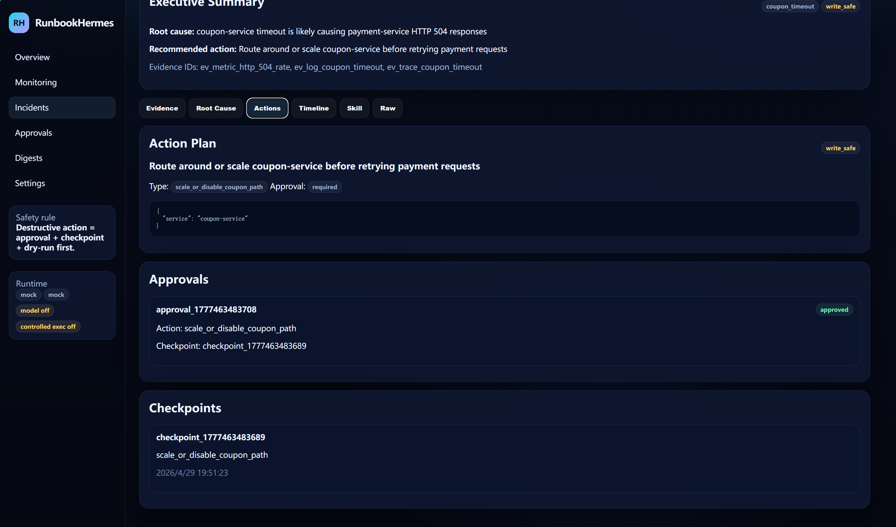

Risky actions are not executed blindly. RunbookHermes places write or destructive actions behind approval, checkpoint, dry-run, controlled execution, and recovery verification.

### Incident Detail: Timeline

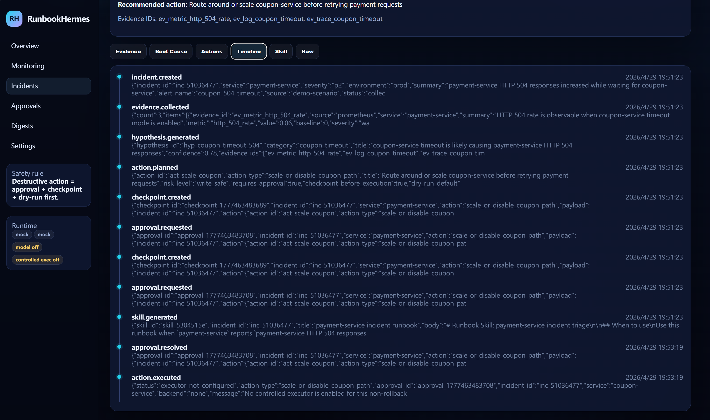

The timeline records the full incident lifecycle, including incident creation, evidence collection, hypothesis generation, action planning, checkpoint creation, approval request, approval decision, skill generation, and execution result.

### Incident Detail: Generated Runbook Skill

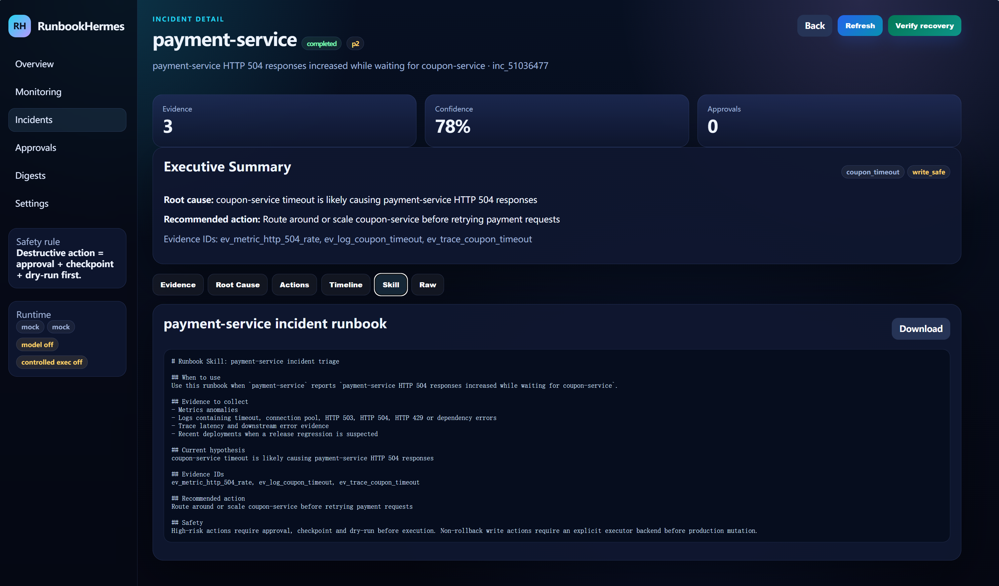

After an incident is processed, RunbookHermes can turn the operational experience into a reusable runbook skill. This is how incident handling becomes accumulated operational knowledge rather than a one-off response.

### Approval Center

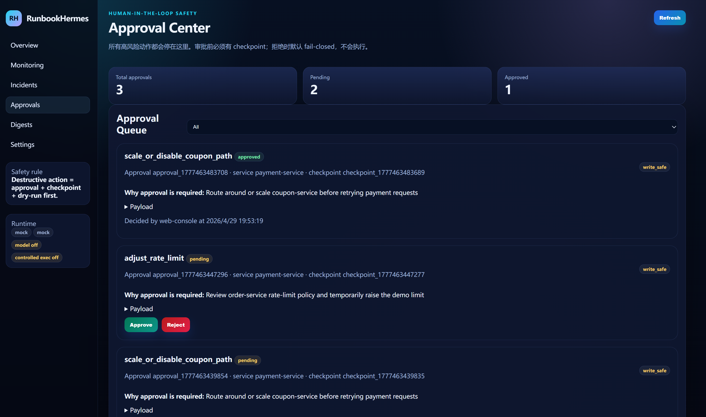

The approval center is the human-in-the-loop safety gate. Operators can review the action, risk level, checkpoint, and payload before approving or rejecting execution.

### Digests and Skills

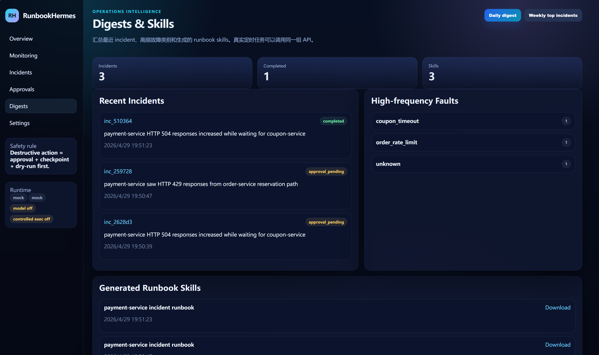

The digest page summarizes recent incidents, high-frequency faults, and generated runbook skills, making RunbookHermes useful for both incident response and operational review.

### Integration Readiness and Interface Status

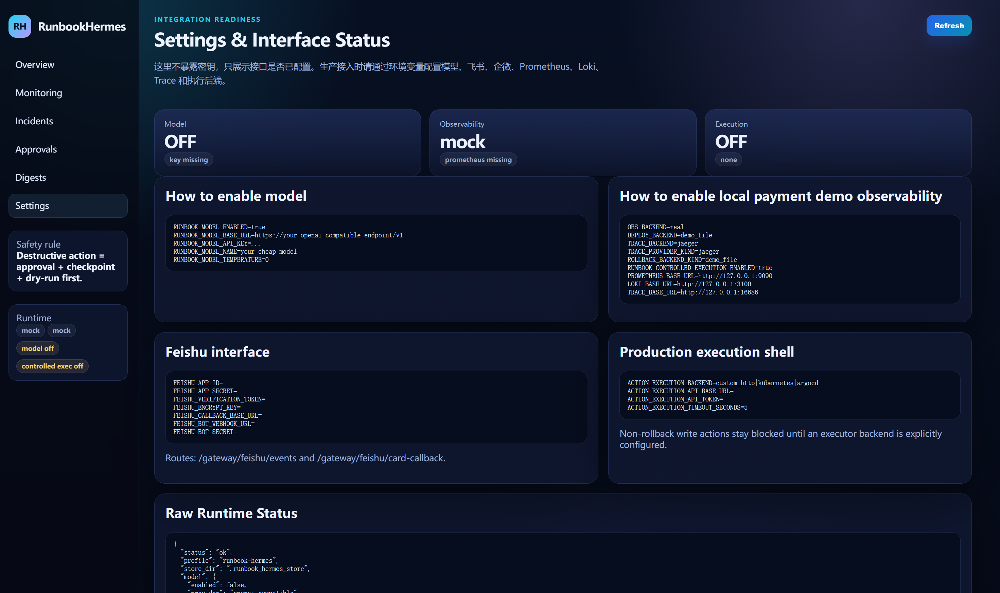

The settings page shows whether model, observability, execution, Feishu, WeCom, and other production integration interfaces are configured. It also documents the environment variables needed to connect real systems.

### Self-Evolving Memory Console

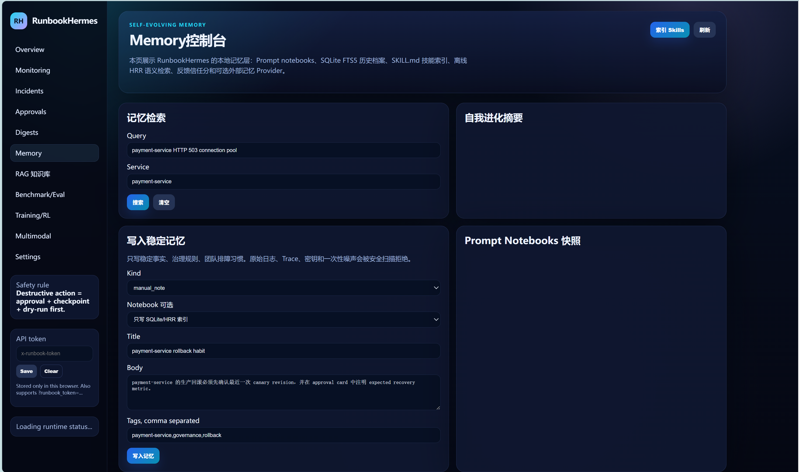

The memory console shows how RunbookHermes accumulates operational knowledge over time. It exposes the local memory layer, including Prompt Notebooks, SQLite FTS5 memory search, HRR-based offline semantic recall, skill indexing, trust scores, and memory feedback.

Operators can search historical incident summaries, fault patterns, service governance rules, and team runbook habits. They can also write stable operational memory such as service profiles, rollback rules, approval preferences, and recurring failure patterns.

This page explains why RunbookHermes becomes more useful the more it is used: each incident can update the system profile, fault-pattern memory, service-governance rules, and team troubleshooting habits instead of disappearing as one-off chat history.

### RAG Knowledge Base

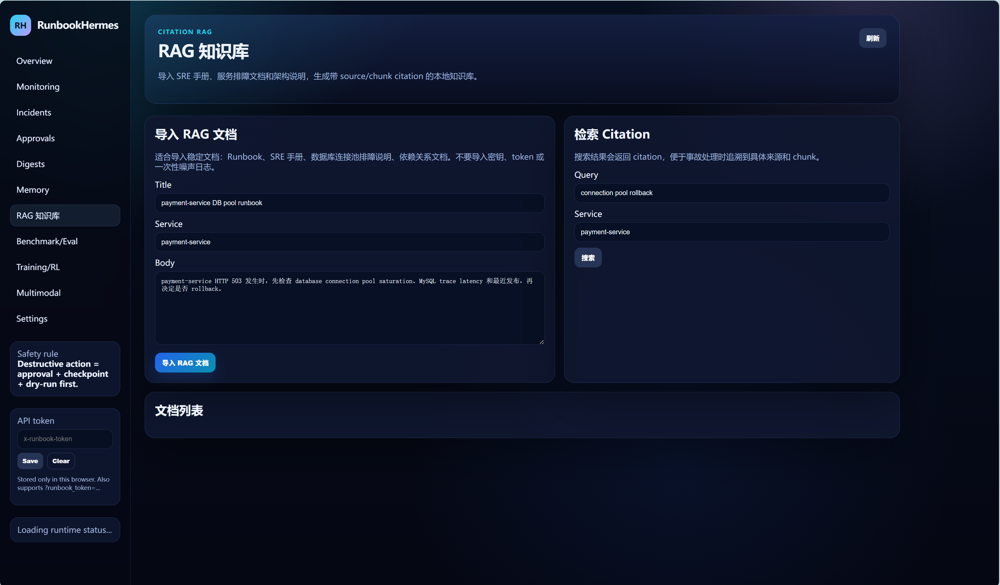

The RAG knowledge base page allows operators to ingest SRE manuals, service troubleshooting documents, architecture notes, and runbook content into a local citation-based knowledge base.

RunbookHermes uses this RAG layer as background knowledge for incident response. Search results include source and chunk citations, so the Agent can reference where an operational recommendation came from instead of producing unsupported answers.

The RAG system is designed for operational documents: service runbooks, rollback guides, dependency notes, database troubleshooting guides, release policies, and generated runbook skills. It helps RunbookHermes connect current evidence with stable engineering knowledge.

### Benchmark and Evaluation Console

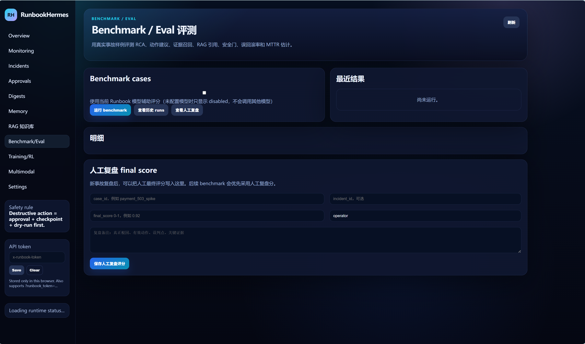

The Benchmark / Eval page measures whether RunbookHermes is improving in the ways that matter for incident response.

It evaluates root-cause accuracy, action recommendation accuracy, evidence recall, RAG citation accuracy, safety-gate behavior, false rollback rate, MTTR target achievement, and final weighted score. This makes RunbookHermes testable instead of relying only on subjective impressions.

The page also supports historical evaluation runs and human postmortem scoring. After real incidents, operators can record final review scores and notes, allowing future benchmark results to reflect both automated checks and human SRE judgment.

### Training / RL / AutoPipeline

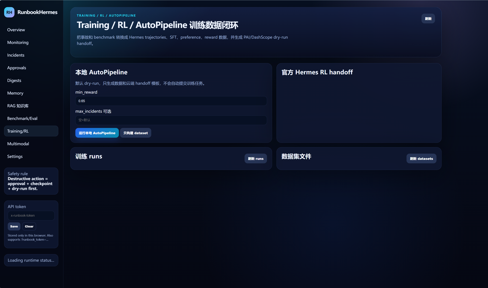

The Training / RL / AutoPipeline page turns incident handling into model-improvement data.

RunbookHermes can convert incidents and benchmark cases into Hermes-compatible trajectories, compressed trajectories, SFT records, preference data, reward labels, and external training handoff files. By default, this pipeline runs in dry-run mode and only generates datasets and cloud-training templates instead of automatically launching external training jobs.

This page represents the learning loop of RunbookHermes: incidents become trajectories, trajectories become training data, training data can improve the next generation of incident-response behavior, and evaluation gates can check whether the new behavior is actually safer and better.

### Multimodal Evidence

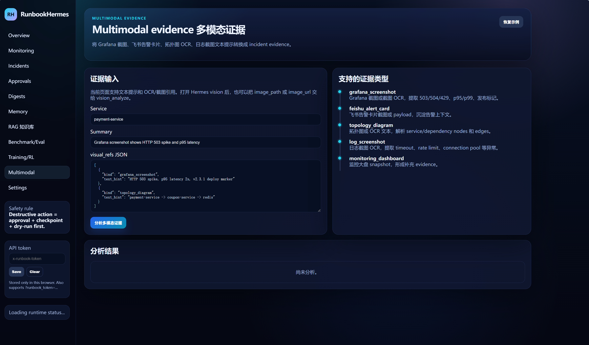

The multimodal evidence page converts visual or semi-visual operational material into structured incident evidence.

It supports inputs such as Grafana screenshots, Feishu alert cards, topology diagrams, log screenshots, OCR text, and monitoring dashboard snapshots. These inputs can be transformed into evidence items that participate in incident diagnosis together with metrics, logs, traces, deploy history, memory, and RAG context.

This is important for real SRE workflows because many incident clues appear first in dashboards, alert cards, topology screenshots, or shared chat images. RunbookHermes treats those materials as evidence sources instead of ignoring them or forcing operators to manually rewrite everything.

### Knowledge Page Split


The old combined knowledge page has been split into dedicated pages for RAG, Benchmark / Eval, Training / RL, and Multimodal Evidence.

This split keeps the Web Console easier to operate: RAG is used for knowledge retrieval, Eval is used for quality measurement, Training is used for data generation and RL handoff, and Multimodal is used for visual evidence extraction.
---

## 3. 整体架构

```text
┌───────────────────────────────────────────────────────────────┐
│                         Entry Layer                           │
│ Web Console / API / Alertmanager / Feishu / WeCom / Hermes CLI│
└──────────────────────────────┬────────────────────────────────┘
                               │
                               ▼
┌───────────────────────────────────────────────────────────────┐
│                    RunbookHermes API / Gateway                │
│ incident intake / webhook normalize / auth / approval callback│
└──────────────────────────────┬────────────────────────────────┘
                               │
                               ▼
┌───────────────────────────────────────────────────────────────┐
│                    Hermes Agent Runtime                       │
│ AIAgent loop / Provider routing / ToolRegistry / Memory / Skill│
│ Context compression / Gateway session / trajectory collection │
└───────────────┬──────────────────────┬────────────────────────┘
                │                      │
                ▼                      ▼
┌────────────────────────────┐ ┌────────────────────────────────┐
│ RunbookHermes Tool Layer   │ │ EvidenceStack Context Layer     │
│ prom_query                 │ │ alert summary                   │
│ loki_query                 │ │ evidence IDs                    │
│ trace_search               │ │ hypotheses                      │
│ recent_deploys             │ │ action plan                     │
│ incident_rca_guard         │ │ approval status                 │
│ action_policy_guard        │ │ recovery result                 │
│ rollback_canary            │ └────────────────────────────────┘
│ verify_recovery            │
└───────────────┬────────────┘
                │
                ▼
┌───────────────────────────────────────────────────────────────┐
│                    AIOps Domain Layer                         │
│ RCA guard / action policy / approval / checkpoint / execution │
│ memory / RAG / multimodal / eval / training / skill publisher │
└───────────────┬──────────────────────┬────────────────────────┘
                │                      │
                ▼                      ▼
┌────────────────────────────┐ ┌────────────────────────────────┐
│ Observability / Runtime    │ │ Learning / Governance           │
│ Prometheus / Loki          │ │ Memory notebooks                │
│ Jaeger / Tempo             │ │ SQLite FTS5 + HRR               │
│ Deploy platform            │ │ RAG citations                   │
│ Kubernetes / Argo / HTTP   │ │ generated SKILL.md              │
│ Payment demo system        │ │ eval cases / training datasets  │
└────────────────────────────┘ └────────────────────────────────┘
```

---

## 4. Hermes Agent 能力在 RunbookHermes 中的落地

| Hermes Agent 能力 | RunbookHermes 中的作用 |
| --- | --- |
| AIAgent 主循环 | 负责事故问答、工具调用、证据收集、推理和最终输出 |
| IterationBudget | 避免排障过程中无限循环调用工具 |
| ToolRegistry | 通过插件注册 Prometheus、Loki、Trace、RCA、审批、执行等工具 |
| sync / async 工具桥接 | 让 Web/API、Gateway、异步后端和同步 Agent 循环可以共存 |
| 多 Provider 适配 | 支持 OpenAI-compatible、OpenRouter、Anthropic、Nous、企业内部模型等接入方式 |
| credential pool / fallback | 支持多 key、限流冷却、失败降级，适合企业模型网关场景 |
| Gateway 架构 | 支撑 Alertmanager、Feishu、WeCom、IM、Web/API 等多入口 |
| Session / State | 保留不同用户、不同平台、不同事故的上下文隔离 |
| SQLite + FTS5 | 用于 memory、RAG、搜索、历史和本地持久化 |
| 上下文压缩 | 长事故排查中保留关键 evidence、approval、checkpoint、action IDs |
| MemoryProvider | RunbookHermes domain memory 通过 Hermes 官方 memory 生命周期接入 |
| Skills | 事故经验可以发布成 Hermes official SKILL.md |
| batch_runner / trajectory_compressor | 事故处理轨迹可以转为训练数据和 RL handoff |
| 安全扫描与原子写入 | 用于 memory 写入、skill 发布、RAG ingestion 的安全边界 |

RunbookHermes 的方向不是重写 Hermes，而是把 Hermes 的通用 Agent 能力变成 SRE 事故响应能力。

---

## 5. 功能全景

### 5.1 事故接入

RunbookHermes 支持多种事故入口：

- Web Console 创建事故；
- API 创建事故；
- Alertmanager webhook；
- Feishu event / card callback；
- WeCom event / card callback；
- Hermes CLI profile 对话；
- demo scenario replay。

所有入口最终都会被标准化成 incident workflow。

```text
alert / message / API
→ normalize
→ create incident
→ collect evidence
→ RCA
→ action policy
→ approval
→ execution
→ recovery verification
→ learning
```

### 5.2 证据采集

RunbookHermes 不是直接问模型“你觉得哪里坏了”，而是用工具采集证据。

当前工具层包括：

```text
prom_query
prom_top_anomalies
loki_query
trace_search
recent_deploys
incident_rca_guard
action_policy_guard
rollback_canary
verify_recovery
execute_controlled_action
```

支持的数据来源包括：

- Prometheus metrics；
- Loki logs；
- Jaeger traces；
- Tempo traces；
- deployment history；
- service profile；
- memory；
- RAG；
- multimodal evidence。

### 5.3 RCA Guard

RCA guard 用 evidence graph 和 service profile 生成根因判断。

典型故障模式包括：

- 发布导致的 DB connection pool regression；
- 下游 dependency timeout；
- order-service rate limit；
- Redis hot key；
- MySQL latency spike；
- inconclusive evidence。

如果证据不足，RunbookHermes 应该返回 `inconclusive`，而不是编造确定结论。

### 5.4 Action Policy

Action policy 根据根因、证据、服务画像和治理规则生成行动建议。

例如：

```text
root cause = deploy_db_regression
service = payment-service
evidence = 503 spike + pool exhausted + mysql trace latency + recent deploy

recommended action:
rollback_canary to previous stable revision

risk:
destructive

required gates:
approval + checkpoint + dry-run + recovery verification
```

### 5.5 审批、Checkpoint、Dry-run、执行

RunbookHermes 对危险动作使用人类审批链路：

```text
action proposal
→ risk classification
→ approval request
→ checkpoint creation
→ dry-run
→ controlled execution
→ recovery verification
→ audit event
```

支持的执行后端方向：

- demo_file；
- custom_http；
- Kubernetes；
- Argo CD；
- internal release platform。

默认是安全模式，不会直接执行真实生产变更。

### 5.6 Recovery Verification

执行后必须验证恢复，而不是执行完就结束。

验证维度包括：

- HTTP 5xx 是否下降；
- p95 latency 是否恢复；
- QPS 是否稳定；
- error logs 是否停止；
- trace error spans 是否下降；
- deploy state 是否回到目标版本。

### 5.7 Web Console

RunbookHermes 提供 Web Console，用于 operator 查看和操作事故。

页面包括：

| 页面 | 作用 |
| --- | --- |
| `/web/index.html` | AIOps 控制台总览 |
| `/web/monitoring.html` | 实时监控系统 |
| `/web/incidents.html` | 事故列表与创建 |
| `/web/incident.html?id=...` | 事故详情、证据、RCA、行动、时间线、skill |
| `/web/approvals.html` | 审批中心 |
| `/web/digests.html` | 事故摘要、技能摘要 |
| `/web/memory.html` | 自进化记忆控制台 |
| `/web/rag.html` | RAG 知识库 |
| `/web/eval.html` | Benchmark / Eval |
| `/web/training.html` | Training / RL / AutoPipeline |
| `/web/multimodal.html` | 多模态证据 |
| `/web/settings.html` | 配置与接口状态 |

### 5.8 自进化 Memory

RunbookHermes 有六层记忆结构：

```text
1. Prompt notebooks
2. SQLite FTS5 历史档案
3. SKILL.md 程序性记忆
4. 本地 HRR 语义检索
5. 可选外部 Memory Provider
6. Trust / Feedback 演化
```

默认 notebooks：

| Notebook | 用途 |
| --- | --- |
| `MEMORY.md` | 全局稳定事实和安全原则 |
| `USER.md` | 团队画像、沟通风格、排障偏好 |
| `SERVICE_PROFILE.md` | 服务画像、依赖关系、治理规则 |
| `FAULT_PATTERNS.md` | 反复出现的故障模式 |
| `TEAM_RUNBOOK_HABITS.md` | 团队审批、排障、复盘习惯 |

记忆写入会经过安全扫描，拒绝保存：

- raw logs；
- full traces；
- credentials；
- private keys；
- prompt injection；
- role header injection；
- customer-sensitive payload。

### 5.9 Hermes Memory Bridge

RunbookHermes domain memory 通过 Hermes 官方 MemoryProvider 接入：

```text
Hermes MemoryManager
→ memory.provider: runbook_hermes
→ RunbookHermes MemoryProvider bridge
→ Memory Router
→ notebooks + SQLite FTS5 + HRR
→ Skill Publisher
→ HERMES_HOME/skills/runbooks/runbookhermes/**/SKILL.md
```

Memory Router 会判断一条消息应该进入哪条路径：

| 消息 | 路由 |
| --- | --- |
| “payment-service P1 503 告警，帮我排障” | incident workflow |
| “记住 coupon-service 高峰期必须先降级” | RunbookHermes domain memory |
| “查一下 coupon-service 以前 504 怎么处理” | memory recall |
| “我喜欢中文回答” | Hermes native user/session memory |
| “保存成 runbook skill” | Hermes official Skills publisher |

### 5.10 Citation RAG

RunbookHermes 内置本地 citation RAG，不依赖外部向量数据库即可运行。

能力包括：

- 文档清洗；
- boilerplate removal；
- heading-aware chunking；
- overlap；
- content hash dedupe；
- SQLite FTS5 lexical retrieval；
- deterministic local hash embedding；
- vector cosine retrieval；
- LIKE fallback；
- candidate fusion；
- local reranking；
- citation IDs；
- score breakdown；
- ACL / permission scope filtering；
- freshness / expires_at filtering；
- low recall / noise / stale diagnostics。

整体链路：
导入文档
→ 安全扫描
→ 清洗文本
→ heading-aware 分块
→ content hash 去重
→ 本地 hash embedding
→ 写入 SQLite
→ 写入 FTS5
→ 用户/事故查询
→ FTS5 + vector + LIKE 混合召回
→ RRF 融合
→ 本地 rerank
→ ACL / expires_at / freshness 过滤
→ 返回 citation
→ 生成 <rag-context>
→ 接入 incident RCA/action/eval/training
RAG 返回结果会带 citation，避免模型凭空引用。

### 5.11 Multimodal Evidence

RunbookHermes 可以把视觉材料转成事故证据：

- Grafana screenshot；
- Feishu alert card；
- topology diagram；
- log screenshot；
- monitoring dashboard。

默认使用 deterministic local parsing。也可以配置 Hermes vision 工具接入图片分析。

### 5.12 Benchmark / Eval

RunbookHermes 提供评测能力，用来衡量 RCA、行动建议、安全性和证据质量。

指标包括：

- RCA accuracy；
- action accuracy；
- evidence recall；
- citation accuracy；
- safety gate rate；
- false rollback rate；
- MTTR target；
- final score。

Eval 默认使用隔离 store，不污染真实 incident 数据。

### 5.13 Training / RL / AutoPipeline

RunbookHermes 可以把事故处理过程导出成模型训练数据：

```text
incident / benchmark case
→ Hermes-compatible trajectory
→ compressed trajectory
→ SFT messages
→ preference pairs
→ reward labels
→ external training handoff
```

输出文件包括：

```text
dataset.jsonl
trajectories.jsonl
compressed.jsonl
sft.jsonl
preference.jsonl
rewards.jsonl
manifest.json
alicloud/pai_dlc_job_spec.json
alicloud/dashscope_finetune_template.json
```

默认不会启动外部云训练。外部训练必须显式打开安全开关。

---

## 6. 为什么 RunbookHermes 越用越懂系统

RunbookHermes 的“越用越懂”不是靠保存所有聊天记录，而是靠结构化沉淀。

### 6.1 越用越懂系统

RunbookHermes 会逐渐沉淀 service profile：

```text
payment-service:
  owner: payment team
  dependencies:
    - mysql-payment
    - coupon-service
    - order-service
  critical signals:
    - HTTP 503 rate
    - p95 latency
    - mysql span latency
    - connection pool errors
  governance:
    - production rollback requires approval
    - checkpoint before destructive action
```

下一次 payment-service 告警时，Agent 不需要从零理解服务。

### 6.2 越用越懂故障模式

RunbookHermes 会把重复出现的问题沉淀成 fault patterns：

```text
payment-service 503 after canary
coupon-service 504 timeout
order-service 429 rate limit
mysql connection pool saturation
redis hot key
bad canary rollout
```

这些模式会帮助 Agent 更快知道应该优先查什么证据。

### 6.3 越用越懂服务治理规则

服务治理规则会进入 memory 和 action policy：

```text
payment-service 生产回滚必须审批
高峰期不能直接重启 order-service
coupon-service 超时时优先降级而不是回滚 payment-service
非变更窗口只能 dry-run
高风险动作必须二次确认 CONFIRM_EXECUTE
```

这些规则可以收紧安全策略，但不能绕过审批和 checkpoint。

### 6.4 越用越懂团队排障习惯

团队习惯会进入 `TEAM_RUNBOOK_HABITS.md`：

```text
P1 事故先发中文摘要到飞书群
RCA 必须列 evidence IDs
审批卡片必须包含 action、risk、checkpoint
复盘需要写清楚误判点和下次如何更快定位
```

这让 RunbookHermes 输出越来越符合团队真实工作方式。

---

## 7. Product Screenshots

当前已存在的截图如下。

### AIOps 控制台


### 实时监控系统


### 事故列表


### 事故证据与摘要


### 根因分析


### 行动、审批、Checkpoint


### 时间线


### 生成 Runbook Skill


### 审批中心


### Digest 与 Skills


### Settings 与接口状态


### 待补充截图

以下页面已经有 Web 页面，但当前还需要补充截图到 `docs/assets/`：

| 页面 | 建议截图文件 |
| --- | --- |
| `/web/memory.html` | `docs/assets/memory-console.png` |
| `/web/rag.html` | `docs/assets/rag-knowledge-base.png` |
| `/web/eval.html` | `docs/assets/eval-benchmark.png` |
| `/web/training.html` | `docs/assets/training-rl.png` |
| `/web/multimodal.html` | `docs/assets/multimodal-evidence.png` |
| `/web/knowledge.html` | `docs/assets/knowledge-split.png` |

---

## 8. Quick Start

### 8.1 安装

```bash
python -m venv .venv
source .venv/bin/activate
pip install -e ".[web,runbook-demo]"
```

Windows PowerShell：

```powershell
python -m venv .venv
.venv\Scripts\Activate.ps1
pip install -e ".[web,runbook-demo]"
```

### 8.2 本地 Web/API Demo

本地 demo 可以关闭 API token：

```bash
export PYTHONPATH=.
export RUNBOOK_API_AUTH_ENABLED=false
python -m uvicorn apps.runbook_api.app.main:app --host 127.0.0.1 --port 8000
```

打开：

```text
http://127.0.0.1:8000/web/index.html
```

注意：FastAPI docs/openapi 默认关闭，不要依赖 `/docs` 作为默认入口。

### 8.3 Hermes-native Agent Profile

```bash
hermes --profile runbook-hermes
```

示例：

```text
payment-service 发布后 HTTP 503 飙升。请先查证据，再判断根因，并给出安全行动方案。
```

预期行为：

```text
recall memory
→ collect metrics/logs/traces/deploy evidence
→ build RCA
→ run action policy
→ require approval if risky
→ verify recovery
→ write memory
→ publish skill when useful
```

---

## 9. Local Payment Demo

RunbookHermes 提供本地支付系统，用于验证完整事故链路。

启动 demo：

```bash
cd demo/payment_system
docker compose up --build
```

包含：

- payment-service；
- order-service；
- coupon-service；
- MySQL；
- Redis；
- Prometheus；
- Loki；
- Promtail；
- Jaeger；
- Grafana。

配置 RunbookHermes：

```bash
export PYTHONPATH=.
export RUNBOOK_API_AUTH_ENABLED=false

export OBS_BACKEND=real
export DEPLOY_BACKEND=demo_file
export TRACE_BACKEND=jaeger
export TRACE_PROVIDER_KIND=jaeger
export ROLLBACK_BACKEND_KIND=demo_file
export RUNBOOK_CONTROLLED_EXECUTION_ENABLED=true

export PROMETHEUS_BASE_URL=http://127.0.0.1:9090
export LOKI_BASE_URL=http://127.0.0.1:3100
export TRACE_BASE_URL=http://127.0.0.1:16686

export DEMO_DEPLOY_STATE_FILE=data/payment_demo/deployments.json
export DEMO_VERSION_FILE=data/payment_demo/runtime/payment-service-version.txt
```

启动 API：

```bash
python -m uvicorn apps.runbook_api.app.main:app --host 127.0.0.1 --port 8000
```

生成流量：

```bash
cd demo/payment_system
python scripts/generate_traffic.py --fault PAYMENT_503_AFTER_DEPLOY --requests 60
python scripts/generate_traffic.py --fault COUPON_504_TIMEOUT --requests 40
python scripts/generate_traffic.py --fault ORDER_429_RATE_LIMIT --requests 40
```

---

## 10. Production Integration

生产环境建议连接：

| 类型 | 示例 |
| --- | --- |
| Model Provider | OpenAI-compatible gateway、OpenRouter、Anthropic、企业内部模型 |
| Metrics | Prometheus |
| Logs | Loki |
| Traces | Jaeger / Tempo |
| Deploy History | Argo CD、Kubernetes、内部发布平台 |
| Execution | custom HTTP executor、Kubernetes、Argo CD |
| ChatOps | Feishu、WeCom、WeChat、Slack 等 |
| Store | JSON、本地 SQLite、Postgres |
| Audit | JSONL、数据库、企业审计系统 |
| Knowledge | docs、runbooks、RAG documents、generated skills |

推荐生产链路：

```text
Alertmanager / Feishu / WeCom / API
→ RunbookHermes API / Gateway
→ Hermes Agent Runner with runbook-hermes profile
→ Prometheus / Loki / Jaeger / Tempo
→ Deploy / Rollback platform
→ Approval center
→ Controlled executor
→ Recovery verification
→ Memory / RAG / Skill / Training
```

---

## 11. 关键环境变量

### API Auth

```bash
RUNBOOK_API_AUTH_ENABLED=true
RUNBOOK_API_TOKEN=
RUNBOOK_API_READ_ONLY_TOKEN=
RUNBOOK_API_AUTH_HEADER=x-runbook-token
```

### Model

```bash
RUNBOOK_MODEL_ENABLED=true
RUNBOOK_MODEL_PROVIDER=openai-compatible
RUNBOOK_MODEL_BASE_URL=https://your-model-gateway/v1
RUNBOOK_MODEL_API_KEY=
RUNBOOK_MODEL_NAME=
RUNBOOK_MODEL_TEMPERATURE=0
```

### Observability

```bash
OBS_BACKEND=real
PROMETHEUS_BASE_URL=
PROMETHEUS_AUTH_TOKEN=
LOKI_BASE_URL=
LOKI_AUTH_TOKEN=
TRACE_BACKEND=jaeger
TRACE_PROVIDER_KIND=jaeger
TRACE_BASE_URL=
TRACE_AUTH_TOKEN=
```

### Store

```bash
RUNBOOK_STORE_BACKEND=json
RUNBOOK_STORE_DIR=.runbook_hermes_store
RUNBOOK_STORE_SQLITE_PATH=.runbook_hermes_store/runbook_store.sqlite3
RUNBOOK_STORE_POSTGRES_DSN=
```

### Memory

```bash
RUNBOOK_MEMORY_ENABLED=true
RUNBOOK_MEMORY_DIR=.runbook_hermes_store/memory
RUNBOOK_MEMORY_CONTEXT_LIMIT=6
RUNBOOK_MEMORY_HRR_DIM=1024
RUNBOOK_MEMORY_EXTERNAL_PROVIDER=none
RUNBOOK_MEMORY_BRIDGE_ENABLED=true
RUNBOOK_MEMORY_ROUTER_ENABLED=true
RUNBOOK_SKILL_PUBLISH_ENABLED=true
```

### RAG

```bash
RUNBOOK_RAG_ENABLED=true
RUNBOOK_RAG_DIR=.runbook_hermes_store/rag
RUNBOOK_RAG_CHUNK_CHARS=1200
RUNBOOK_RAG_CHUNK_OVERLAP=160
RUNBOOK_RAG_CONTEXT_LIMIT=5
RUNBOOK_RAG_EMBEDDING_MODEL=local-hash-embedding-v1
```

### Controlled Execution

```bash
RUNBOOK_CONTROLLED_EXECUTION_ENABLED=true
ACTION_EXECUTION_BACKEND=custom_http
ACTION_EXECUTION_API_BASE_URL=
ACTION_EXECUTION_API_TOKEN=
ACTION_EXECUTION_ALLOWED_OPERATIONS=rollback_canary,restart_deployment
ACTION_EXECUTION_REQUIRE_SECOND_CONFIRMATION=true
ACTION_EXECUTION_CONFIRMATION_TOKEN=CONFIRM_EXECUTE
```

### Training / RL

```bash
RUNBOOK_TRAINING_ENABLED=true
RUNBOOK_TRAINING_DIR=.runbook_hermes_store/training
RUNBOOK_TRAINING_MAX_INCIDENTS=100
RUNBOOK_TRAINING_MIN_REWARD=0.65
RUNBOOK_TRAINING_BASE_MODEL=Qwen/Qwen3-8B
RUNBOOK_TRAINING_EXTERNAL_LAUNCH_ENABLED=false
```

---

## 12. 一次真实事故的完整工作流

下面是假设所有接口都接好之后，一次事故发生时 RunbookHermes 的完整流程。

### 场景

```text
payment-service 在 v2.3.1 canary 发布后 HTTP 503 飙升。
Prometheus Alertmanager 触发 P1 告警。
Feishu / WeCom 群收到事故卡片。
On-call 工程师开始和 RunbookHermes 对话。
```

### 12.1 告警进入

```text
Alertmanager
→ POST /gateway/alertmanager
→ normalize event
→ create incident
→ incident_id=inc_xxxxx
```

RunbookHermes 写入 timeline：

```text
incident.created
alert.normalized
gateway.received
```

### 12.2 工程师对话

Operator：

```text
@RunbookHermes payment-service 503 飙升，先不要回滚。请查证据，判断是不是 v2.3.1 发布导致。
```

RunbookHermes：

```text
收到。我会先执行只读排查，不执行任何变更。

我会：
1. 召回 payment-service 的服务画像、历史故障和治理规则；
2. 查询 Prometheus 的 503 rate、p95 latency、QPS；
3. 查询 Loki 中 payment-service 错误日志；
4. 查询 Jaeger/Tempo trace；
5. 查询最近 deploy history；
6. 用 RCA guard 生成证据链和根因假设；
7. 如果需要回滚，只创建审批和 dry-run 计划，不会直接执行。
```

### 12.3 Memory recall

```text
runbook_memory_recall(
  service="payment-service",
  query="payment-service HTTP 503 after canary v2.3.1",
  limit=6
)
```

可能召回：

```text
- payment-service depends on mysql-payment and coupon-service
- production rollback requires SRE approval
- previous 503 spike involved connection pool exhaustion
- team prefers Chinese P1 summary in Feishu
```

RunbookHermes 会把这些作为 weak prior，而不是当前证据。

### 12.4 RAG context

```text
runbook_rag_context(
  service="payment-service",
  query="HTTP 503 canary rollback connection pool runbook"
)
```

可能召回：

```text
docs/integrations/rollback-executor.md#chunk-2
skills/runbooks/payment-503-spike/SKILL.md#chunk-1
docs/operations/approval-checkpoint-recovery.md#chunk-3
```

### 12.5 Evidence collection

```text
prom_top_anomalies(service="payment-service", window="15m")
loki_query(service="payment-service", query="503 OR connection pool OR mysql")
trace_search(service="payment-service", error_only=true)
recent_deploys(service="payment-service", since="2h")
runbook_multimodal_analyze(...)
```

得到证据：

```text
ev_metric_1:
  503 rate increased from 0.2% to 18% after v2.3.1 canary

ev_metric_2:
  p95 latency increased from 120ms to 2.4s

ev_log_1:
  connection pool exhausted appears after deploy marker

ev_trace_1:
  mysql-payment span latency and error count increased

ev_deploy_1:
  payment-service v2.3.1 deployed 8 minutes before spike

ev_visual_1:
  Grafana screenshot shows 503 spike aligned with deploy marker
```

### 12.6 RCA guard

```text
incident_rca_guard(
  service="payment-service",
  evidence=[ev_metric_1, ev_metric_2, ev_log_1, ev_trace_1, ev_deploy_1]
)
```

输出：

```text
category: deploy_db_regression
confidence: 0.91
evidence_ids:
  - ev_metric_1
  - ev_metric_2
  - ev_log_1
  - ev_trace_1
  - ev_deploy_1
```

RunbookHermes 回复：

```text
当前最可能根因是 v2.3.1 canary 引入的 database connection pool regression。

证据：
- ev_metric_1：503 rate 在 v2.3.1 后从 0.2% 升到 18%
- ev_metric_2：p95 latency 从 120ms 升到 2.4s
- ev_log_1：Loki 出现 connection pool exhausted
- ev_trace_1：MySQL span latency 和 error_count 升高
- ev_deploy_1：v2.3.1 在故障前 8 分钟发布

历史 memory 只作为 weak prior，最终判断来自当前证据。
```

### 12.7 Action policy

```text
action_policy_guard(
  service="payment-service",
  hypothesis={
    "category": "deploy_db_regression",
    "confidence": 0.91,
    "evidence_ids": [...]
  }
)
```

输出：

```text
action_type: rollback_canary
target_revision: v2.3.0
risk_level: destructive
requires_approval: true
checkpoint_before_execution: true
dry_run_default: true
```

RunbookHermes 回复：

```text
推荐动作：rollback payment-service canary from v2.3.1 to v2.3.0。

这是 destructive action，不能直接执行。
我已创建 approval request 和 checkpoint。

approval_id: approval_xxxxx
checkpoint_id: chk_xxxxx
```

### 12.8 Feishu / WeCom 审批

审批卡片包含：

```text
Action: rollback_canary
Service: payment-service
Target: v2.3.0
Risk: destructive
Evidence:
- ev_metric_1
- ev_log_1
- ev_trace_1
- ev_deploy_1
Checkpoint: chk_xxxxx
Buttons:
- Approve
- Reject
- View Incident
```

Operator：

```text
批准 approval_xxxxx CONFIRM_EXECUTE。先 dry-run。
```

### 12.9 Dry-run

```text
rollback_canary(
  service="payment-service",
  target_revision="v2.3.0",
  dry_run=true,
  approval_id="approval_xxxxx",
  checkpoint_id="chk_xxxxx"
)
```

输出：

```text
dry_run: true
allowed: true
approval_status: approved
checkpoint_present: true
command_preview: argocd app rollback payment-service-prod v2.3.0
```

### 12.10 Controlled execution

```text
rollback_canary(
  service="payment-service",
  target_revision="v2.3.0",
  dry_run=false,
  approval_id="approval_xxxxx",
  checkpoint_id="chk_xxxxx"
)
```

RunbookHermes 检查：

```text
approval approved
checkpoint exists
operation allowlisted
second confirmation ok
executor configured
audit id generated
```

### 12.11 Recovery verification

```text
verify_recovery(service="payment-service", window="2m")
```

输出：

```text
503 rate: 18% -> 0.6%
p95 latency: 2.4s -> 180ms
trace error_count: down
connection pool exhausted logs stopped
status: recovered
```

RunbookHermes 回复：

```text
恢复验证通过。

- 503 rate 从 18% 降到 0.6%
- p95 latency 从 2.4s 降到 180ms
- trace error_count 明显下降
- connection pool exhausted 日志停止出现

事故可标记为 recovered。
```

### 12.12 学习与沉淀

```text
runbook_memory_write(kind="incident_summary", ...)
runbook_memory_write(kind="fault_pattern", ...)
runbook_memory_write(kind="team_preference", ...)
runbook_publish_skill(...)
runbook_training_build_dataset(...)
```

最终产物：

```text
memory:
  payment-service v2.3.1 canary caused db pool saturation

fault pattern:
  503 after canary + connection pool exhausted + mysql trace latency

skill:
  HERMES_HOME/skills/runbooks/runbookhermes/payment-service-canary-db-pool-regression/SKILL.md

training:
  trajectories.jsonl
  sft.jsonl
  preference.jsonl
  rewards.jsonl
```

---

## 13. Repository Layout

```text
runbook-hermes/
├── run_agent.py                          # Hermes Agent core loop
├── model_tools.py                        # Hermes tool dispatch
├── agent/                                # Provider、memory、context、retry、trajectory
├── gateway/                              # Hermes gateway foundation
├── hermes_cli/                           # Hermes CLI
├── profiles/runbook-hermes/              # RunbookHermes profile、SOUL、allowlist
├── plugins/runbook-hermes/               # RunbookHermes tools
├── plugins/memory/runbook_hermes/        # Hermes MemoryProvider bridge
├── plugins/context_engine/evidence_stack/# EvidenceStack context engine
├── runbook_hermes/                       # AIOps domain logic
├── apps/runbook_api/                     # FastAPI Web/API service
├── web/static/                           # Web Console pages
├── integrations/observability/           # Prometheus / Loki / Trace / Deploy adapters
├── toolservers/observability_mcp/        # Observability MCP boundary
├── skills/runbooks/                      # Built-in runbook skills
├── demo/payment_system/                  # Local payment demo system
├── data/runbook_profiles/                # Service profiles
├── data/runbook_benchmark/               # Eval cases
├── docs/                                 # Architecture / deployment / operations docs
├── scripts/                              # Validation / smoke / eval / training scripts
└── tests/runbook/                        # RunbookHermes tests
```

---

## 14. Validation

基础检查：

```bash
export PYTHONPATH=.
python -m compileall -q runbook_hermes apps/runbook_api integrations/observability plugins/runbook-hermes plugins/memory/runbook_hermes plugins/context_engine/evidence_stack
```

核心验证脚本：

```bash
python scripts/runbook_validate.py
python scripts/runbook_gateway_smoke.py
python scripts/runbook_no_legacy_imports.py
python scripts/runbook_monitoring_validate.py
python scripts/runbook_memory_validate.py
python scripts/runbook_hermes_bridge_validate.py
python scripts/runbook_phase3_4_validate.py
python scripts/runbook_eval_advanced_validate.py
python scripts/runbook_eval_regression_gate.py
python scripts/runbook_training_validate.py
python scripts/runbook_web_api_smoke.py
bash scripts/runbook_docker_smoke.sh
```

---

## 15. 当前注意事项

以下是当前项目需要继续整理或补齐的地方。

1. 新增页面截图还未补齐  
   `memory.html`、`rag.html`、`eval.html`、`training.html`、`multimodal.html`、`knowledge.html` 已存在，但还缺对应的 `docs/assets/*.png` 截图。

2. `plugins/runbook-hermes/plugin.yaml` 工具声明需要同步  
   实际插件代码已注册更多工具，包括 memory、RAG、multimodal、eval、training 工具；`plugin.yaml` 中的 `provides_tools` 仍是较早的工具列表，建议后续同步。

3. `pyproject.toml` 仍保留上游包名  
   当前包名仍是 `hermes-agent`。如果后续要把 RunbookHermes 作为独立产品发布，需要决定是否改包名、版本和发布策略。

4. API docs 默认关闭  
   FastAPI 的 `/docs`、`/redoc`、`/openapi.json` 默认关闭，这是生产安全取向。开发环境如需 API docs，需要显式打开。

5. 生产执行后端必须谨慎配置  
   Kubernetes、Argo CD、custom HTTP executor 必须配合 allowlist、approval、checkpoint、second confirmation 和 audit 使用，不能直接开放给模型自由执行。

6. 外部训练默认不启动  
   Training pipeline 默认只生成本地数据和 handoff 文件。真正启动外部训练必须显式打开安全开关并人工审核。

---

## 16. Roadmap

```text
v0.1  Hermes-native incident-response foundation
v0.2  Memory bridge、skill publisher、monitoring UI
v0.3  Production observability adapters
v0.4  Feishu / WeCom / WeChat ChatOps
v0.5  Kubernetes / Argo controlled remediation
v0.6  Enterprise RAG + eval regression gates
v0.7  Multimodal evidence
v0.8  RL-ready training data and AutoPipeline handoff
v1.0  Production reference architecture
```

---
